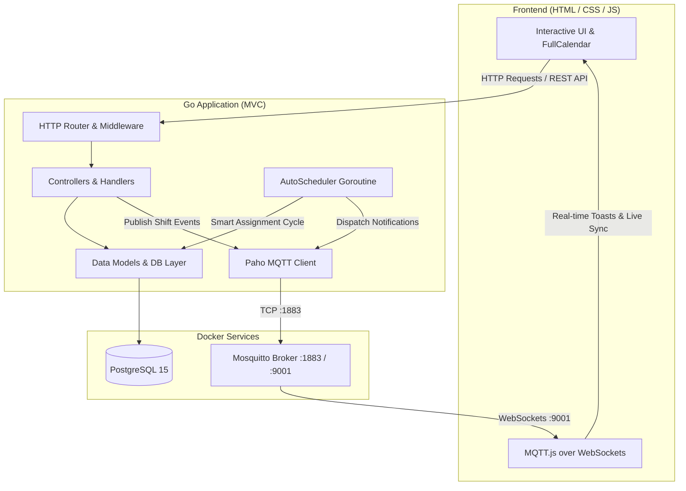

# ShiftPro - Enterprise Shift Management System

[](https://golang.org)
[](https://www.postgresql.org/)
[](https://mosquitto.org/)
[](https://www.docker.com/)

**ShiftPro** is a modern, full-stack **Shift Management System** engineered in **Go (Golang)** with **PostgreSQL**, **Eclipse Mosquitto (MQTT)**, and **FullCalendar**. It delivers intelligent automated rostering via background cron jobs, real-time bidirectional event streaming via MQTT over WebSockets, conflict-free scheduling validation, shift swap workflows, and an intuitive UI.

---

## 🚀 Key Architectural Concepts

### 1. 🔄 Automated Cron Scheduler & Smart Auto-Rostering
* **Goroutine & Ticker-Based Background Engine**: Implements a concurrent worker thread (`time.Ticker` inside a Go routine with `sync.RWMutex`) that runs recurring cycles to automatically populate rosters.
* **Intelligent Shift Distribution**: Plans ahead for upcoming cycles (next 7 days), rotating shifts evenly among active staff while respecting availability.
* **Quota & Conflict Validation**: Evaluates overlapping shift assignments and capacity limits (`quota`) per shift type before committing allocations.
* **Dynamic Control & Triggering**: Admins can toggle the auto-scheduler ON/OFF in real-time or trigger an immediate on-demand assignment cycle from the dashboard.

### 2. 📡 Real-Time MQTT Pub/Sub Event Bus
* **Decoupled Event Streaming**: Backend services publish domain events (e.g. `shift_assigned`, `swap_requested`, `swap_approved`, `shift_replaced`, `shifts_auto_generated`) through the **Eclipse Paho MQTT** client.
* **MQTT over WebSockets in Browser**: Frontend clients connect to the Mosquitto broker directly over WebSockets (`ws://localhost:9001`) using `MQTT.js`.
* **Instant UI Updates & Toasts**: Real-time push notifications, live toast alerts, unread counter badges, and instant calendar synchronization without requiring constant HTTP polling.
* **Granular Topic Topology**:
  * Broadcast Topic: `shiftpro/shifts` (system-wide roster events & calendar sync)
  * Personal Topic: `shiftpro/notifications/{username}` (user-targeted alerts & swap status)

### 3. 🛡️ Role-Based Access Control (RBAC) & Session Auth
* **Cookie-Based Sessions**: Secure authentication flow with Go middleware verifying login states before protected routes.
* **Dual Role Capabilities**:
  * **Admin**: Manage users, define shift types, set quotas, assign/edit/delete shifts, approve/reject swaps, execute manual replacements, and control the cron scheduler.
  * **Employee**: View personal assignments, visualize organization-wide schedules on an interactive calendar, request shift swaps with peers, and extend shift durations.

### 4. 🗄️ Relational Persistence & Schema Integrity
* **PostgreSQL Schema**: Structured data models with relational constraints:
  * `users`: Credentials and roles (`admin`, `user`).
  * `shift_types`: Time ranges (e.g., Morning, Afternoon, Night) with custom seat limits (`quota`).
  * `allocations`: Staff assignments with status tracking (`Confirmed`, `Pending Approval`).
  * `notifications`: Persistent alert history with read/unread statuses.

### 5. 📅 Interactive Calendar & Notification Center
* **FullCalendar Integration**: Visual monthly and weekly shift roster loaded asynchronously via REST APIs (`/api/allocations`) with dynamic color coding by shift category.
* **In-App Notification Center**: Dropdown menu storing historical alerts with quick "Clear All" API persistence.
* **Keyboard Shortcut Support**: Global navigation search with `⌘K` / `Ctrl+K`.

---

## 🏛️ System Architecture



---

## 🛠️ Tech Stack

| Component | Technology | Description |
| :--- | :--- | :--- |
| **Backend** | Go (Golang 1.24+) | High-performance compiled backend & concurrent services |
| **Broker** | Eclipse Mosquitto | Lightweight MQTT message broker with WebSocket support |
| **MQTT Client** | Eclipse Paho Go | Backend MQTT publish/subscribe library |
| **Database** | PostgreSQL 15 | Relational SQL database with foreign key relations |
| **Frontend** | Vanilla JS, HTML5, CSS3 | Custom responsive UI with glassmorphism styling |
| **Calendar** | FullCalendar 6 | Dynamic month/week roster visualization |
| **Containerization** | Docker & Docker Compose | Multi-container orchestration |
| **Live Reload** | Air (Go) | Fast local development reload tool |

---

## 📁 Project Structure

```text
.
├── main.go                     # Application entrypoint & service initializations
├── routes/
│   └── routes.go               # HTTP routing table (Auth, Admin, User, APIs)
├── controllers/                # HTTP request handlers
│   ├── auth.go                 # Login, logout & landing
│   ├── dashboard.go            # Admin/User views & calendar data assembly
│   ├── cron.go                 # Auto-scheduler toggle & manual trigger APIs
│   ├── shifts.go               # Shift creation, assignment & quota updates
│   ├── replace.go              # Employee shift replacement workflow
│   ├── approve.go              # Swap request approval handler
│   ├── delete.go               # Shift & allocation deletion handlers
│   └── users.go                # Employee registration & user deletion
├── services/                   # Core background business logic
│   ├── cron.go                 # Background auto-scheduler, ticker & roster algorithm
│   └── mqtt.go                 # MQTT client initialization & event publisher
├── models/                     # Database access layer & SQL queries
│   ├── models.go               # DB connection initialization (lib/pq)
│   ├── user.go                 # User entity & authentication queries
│   ├── shift.go                # Shift definitions & quota queries
│   ├── allocation.go           # Shift allocation queries & calendar API helpers
│   ├── allocation_actions.go   # Swap, replace, approve & edit actions
│   ├── validation.go           # Overlap & capacity availability checks
│   └── notification.go         # Persistent notification queries
├── templates/                  # HTML templates (Go html/template)
│   ├── base.html               # Main layout, nav, toasts, MQTT subscriber
│   ├── login.html              # Modern login page
│   └── partials/               # Dynamic views (calendar, admin roster, cron card, etc.)
├── static/                     # Static assets (CSS, JS)
│   ├── css/style.css           # Glassmorphism design system & responsive layout
│   └── js/app.js               # Client MQTT listener, FullCalendar init & modal handlers
├── database/
│   └── init.sql                # Initial schema definition & default admin seed
├── config/
│   └── mosquitto.conf          # Mosquitto broker config (ports 1883 & 9001 WS)
├── Dockerfile                  # Go application container build
└── docker-compose.yml          # Postgres, Mosquitto, and Go App stack orchestration
```

---

## ⚡ Quick Start

### Prerequisites
* [Docker](https://docs.docker.com/get-docker/) and [Docker Compose](https://docs.docker.com/compose/) installed, **OR**
* [Go 1.24+](https://golang.org/dl/), [PostgreSQL](https://www.postgresql.org/), and [Mosquitto](https://mosquitto.org/) installed locally.

### Option 1: Run with Docker Compose (Recommended)

Start the entire stack (Postgres database, Mosquitto broker, and Go app) in one command:

```bash
docker compose up --build
```

Access the application in your browser:
* **Web UI:** [http://localhost:8080](http://localhost:8080)
* **MQTT TCP Port:** `1883`
* **MQTT WebSockets Port:** `9001`
* **PostgreSQL Port:** `5432`

---

### Option 2: Run Locally

1. **Start PostgreSQL and Mosquitto:**
   Ensure PostgreSQL is running with database `gobasics` and Mosquitto is running with WebSockets enabled on port 9001.

2. **Initialize Database:**
   ```bash
   psql -U go_user -d gobasics -f database/init.sql
   ```

3. **Install Dependencies & Run:**
   ```bash
   go mod tidy
   go run main.go
   ```

---

## 🔑 Default Credentials

| Username | Password | Role | Permissions |
| :--- | :--- | :--- | :--- |
| **admin** | `admin123` | Administrator | Full access, roster generator, cron toggle, user management |
| **alice** | `alice123` | Employee | View roster, calendar view, shift swap requests |

*(Additional employees can be registered directly from the Admin Dashboard).*

---

## 📡 MQTT Topics & Payloads

### Published Topics

| Topic | Description | Trigger |
| :--- | :--- | :--- |
| `shiftpro/shifts` | Broadcast channel for all shift events | Any shift assignment, replacement, or auto-generation |
| `shiftpro/notifications/{username}` | Direct channel for targeted user | New assignment, swap approval, or shift transfer |

### Sample Payload Format
```json
{
  "type": "shift_assigned",
  "title": "New Shift Assigned",
  "message": "You have been assigned to Morning shift (2026-09-16 to 2026-09-16)",
  "employee": "alice",
  "shiftName": "Morning",
  "startDate": "2026-09-16",
  "endDate": "2026-09-16",
  "timestamp": "2026-09-15T21:00:00Z"
}
```

---

## 👤 Author

**Nishchal**

⭐ Feel free to star or fork this repository!
